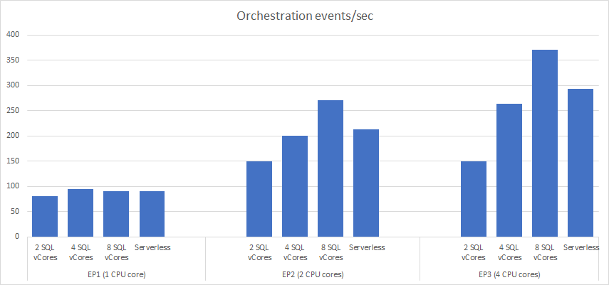



  

# Microsoft SQL Provider for the Durable Task Framework

The Microsoft SQL provider for the [Durable Task Framework](https://github.com/Azure/durabletask) (DTFx) persists all task hub state in a Microsoft SQL database, which can be hosted in the cloud or in your own infrastructure.
This provider includes support for all DTFx features, including orchestrations, activities, and entities, and has full support for [Azure Durable Functions](https://docs.microsoft.com/azure/azure-functions/durable/durable-functions-overview).

> ⚠ **IMPORTANT**: This project is currently under active development, working towards an initial _alpha_ release. Not all features are fully implemented and some names my change. It is not yet appropriate for use in production.

## Documentation

Want to learn more? Detailed information about this provider and getting started instructions can be found [here](https://azure.github.io/durabletask-mssql/).

## How it works

The DTFx schema is provisioned in the target database when the orchestration service is created (`IOrchestrationService.CreateAsync()`). It is not necessary to run any database provisioning scripts. If you're using Durable Functions, this provisioning happens automatically when the Functions host starts up. You can view the scripts use to provision the schema [here](src/DurableTask.SqlServer/Scripts). All tables, views, and stored procedures are provisioned under a `dt` schema to distinguish it from any existing schema in the database.

The tables are as follows:

* **dt.Instances**: Contains a list of all orchestration and entity instances that exist in this database.
* **dt.History**: Contains the event history for all orchestration instances.
* **dt.NewEvents**: Contains a queue of unprocessed events for existing instances.
* **dt.NewTasks**: Contains a queue of unprocessed activity tasks for running instances.
* **dt.Versions**: Contains a record of schema versions that have been provisioned in this database.
* **dt.Payloads**: Contains the payload blobs for all instances, events, tasks, and history records.

You can find the version of the database schema in the `dt.Versions` table. If you create an application using one version of the SQL provider and then later upgrade to a newer version of the provider, the provider will automatically take care of upgrading the database schema, without introducing any downtime.

## Cloud Performance

The following tests demonstrate the performance characteristics of the SQL provider while running in **Azure Functions**. The configuration is as follows:

* Scenario: **Single worker, 1000 "hello world" activity chains (5 activities)**
* Functions runtime: **3.0**
* Region: **West US 2**
* Hosting plan: **Elastic Premium**
* Operating system: **Windows**
* Application Insights: **Enabled, warnings only**
* Host configuration: **See the [host.json](test/PerformanceTests/host.json) file**

The following are the test results as of `v0.4.0-alpha`. Note that _Events/sec_ represents a one way messaging operation. For example, calling an activity function and handling the response is two distinct events. Resuming from a durable timer or receiving an external event would be consider one event.

| Compute | SQL vCores | Total time (sec) | Events/sec |
|-|-|-|-|
| EP1 (1-core) | 2 | 124 | 80.6 |
| EP1 (1-core) | 4 | 106 | 94.3 |
| EP1 (1-core) | 8 | 110 | 90.9 |
| EP1 (1-core) | Serverless | 111 | 90.1 |
| EP2 (2-core) | 2 | 67 | 149.3 |
| EP2 (2-core) | 4 | 50 | 200.0 |
| EP2 (2-core) | 8 | 37 | 270.3 |
| EP2 (2-core) | Serverless | 47 | 212.8 |
| EP3 (4-core) | 2 | 67 | 149.3 |
| EP3 (4-core) | 4 | 38 | 263.2 |
| EP3 (4-core) | 8 | 27 | 370.4 |
| EP3 (4-core) | Serverless | 34 | 294.1 |

Here is the same information in bar chart form.

Some key takeaways from this data:

* When using one a single compute core, no amount of SQL vCores will make much difference in terms of throughput.
* Throughput increases when adding either CPU cores or SQL vCores.
* The Serverless tier of Azure SQL quickly scales to the maximum configured vCore count (8 in this test), resulting in good performance even for shorter bursts.

Note that these tests were executed and the data gathered in an ad-hoc way, so it's possible that there may be some errors and anomalies in these results. Your results may vary.

## Code of Conduct

 This project has adopted the [Microsoft Open Source Code of conduct](https://opensource.microsoft.com/codeofconduct/).
 For more information see the [Code of Conduct FAQ](https://opensource.microsoft.com/codeofconduct/faq/) or contact [opencode@microsoft.com](mailto:opencode@microsoft.com) with any additional questions or comments.
